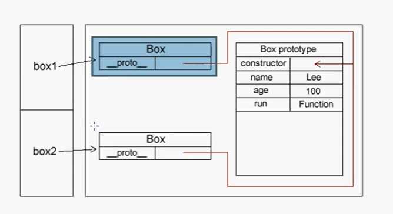
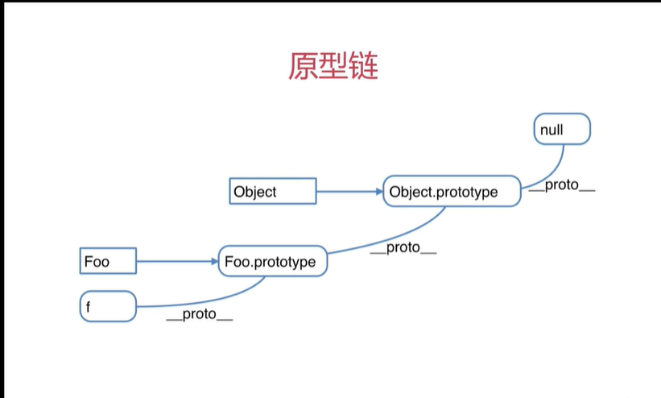

# 面向对象与原型

ECMAScript有两种开发模式:

1. 函数式(过程化)
2. 面向对象(OOP)

面向对象语言有一个标志，那就是类的概念，而通过类可以创建任意多个具有相同属性和方法的对象。但是，ECMAScript没有类的概念，因此它的对象也与基于类的语言中的对象有所不同。

## 创建对象

### 1、通过new Object方法创建对象

```js
var people = new Object()
people.name = "tony"
people.age = 21
people.eat = function(){
    return "我会吃饭"
}
console.log(people.age + '------' +people.name+'-------'+people.eat())
```

但是这种方法只能一个一个去创建，属性，方法基本类似。跟女娲造人一个样儿，得一个个捏，可累

### 2、通过 工厂模式方法，去解决实例化对象产生的大量重复问题

```js
function createPeople(name,age){
    var obj = new Object()
    obj.name = name
    obj.age = age
    obj.eat = function(){
        return "我会吃"
    }
    return obj 
}

var people1 = createPeople("tony",21)
var people2 = createPeople("pony",37)

console.log(people1.age)
console.log(people2.age)
```

这种模式解决了重复实例化的问题，但是还有问题就是不能搞清楚他们到底是哪个对象的实例。

### 3、构造函数创建

ECMAScript 中可以采用构造函数(构造方法)可用来创建特定的对象，类型于Object对象

```js
function People(name,age){
    this.name = name
    this.age = age
    this.eat = function(){
        return "我会吃"
    }
    //return this  //默认会有这一行
}

var people1 = new People("tony",21)
var people2 = new People("pony",37)
//1.构造函数没有new Object 但它后台会自动 var obj = new Object
//2.this 就相当于obj
//3.构造函数不需要返回构造引用，它是自动返回的
console.log(people1.age)    //实例化
console.log(people2.age)    //实例化
```

**使用构造函数的方式，及解决了重复实例化的问题**

#### 构造函数规范

1. 函数名和实例化构造名相同且大写，
2. 通过构造函数创建对象，必须使用new运算符
3. 构造函数和普通函数的唯一区别，技术他们调用的方式不同。只不过，构造函数也是函数，必须通过new 运算符来调用，否则就是普通函数。

### 原型

我们创建的每个函数都有一个prototype(原型)属性，这个属性是一个对象，它的用途是包含可以由特定类型的所有实例共享的属性和方法。逻辑上可以这么理解：prototype通过调用构造函数而创建的那个对象的原型对象。使用原型的好处可以让所有的实例共享它所包含的属性和方法

## 构造函数-扩展

- ``` js
  var a = { }  其实是var a = new Object() 的语法糖
  ```
- ``` js
  var a = []  其实是var a = new Array() 的语法糖
  ```
- ``` js
  function Foo(){...}  其实是var Foo = new Function(....)的语法糖
  ```
- ``` js
  使用instanceof判断一个函数是否是一个变量的构造函数
  ```

## 原型规则和示例

- ### 5条原型规则，**原型规则**是学习**原型链**的基础

- **1.** 所有的引用类型(**数组，对象，函数**)，都具有对象特性，即可**自由扩展属性**(除了“null”以外)

- **2.**所有的引用类型(**数组，对象，函数**)，都有一个**`__porto__`属性**，属性值都是一个普通对象。（`__proto__`）叫做**隐式原型**

- **3.** 所有的**函数**，都有一个prototype(**显示原型**)属性，属性值也是一个普通的对象

- **4.** 所有的引用类型(**数组，对象，函数**)，`_proto_`属性值指向它的构造函数的“prototype”属性值

- **5.**当试图得到一个对象的某个属性时，如果这个对象本身没有这个属性，那么就会去它的`_proto_`即(它的构造函数的prototype)中去寻找

  - ```js 
    console.log(obj.__proto__ === Object.prototype)
    ```

  - 因为：var obj = {}   =>var a = new Object()    语法糖

  - 又：Object 是一个构造函数，构造函数都有一个prototype(显示原型)属性

  - 又：所有的引用类型都有一个隐式原型，根据第四条

  - 所以：它俩指向的内容完全相等



在原型模式声明中，多了两个属性，这两个属性都是创建对象时自动生成的。`__proto__`属性是实例指向原型对象的一个指针，它的作用就是指向构造函数的原型属性construct。

### 循环对象自身的属性

```js
for (const key in object) {
    //如果对象有这个属性的时候
    if(object.hasOwnProperty(key)) {
        const element = object[key];
    }
}
```

### 原型链

```js
//会通过函数的__proto__属性往上查找要查找的属性或者方法
```



#### 判断一个对象是否指向了该构造函数的原型对象可以使用

`isPrototypeOf()方法`

#### 原型模式的执行流程：

1. 先查找构造函数实例里的属性或方法，如果有，立刻返回
2. 如果构造函数实例里没有，则去它的原型对象里找，如果有，就返回；

#### 删除属性

1. delete box1.name;	//删除实例中的属性
2. delete Box.prototype.name //删除原型中的属性

#### 字面量方式创建原型对象，添加原型属性方法

```js
function Box(){}
//字面量方式创建原型对象，这里{}就是对象，是Object
Box.prototype = {
    name:"lee",
    age:100,
    run:function(){
        return this.name + this.age+'。。。。'
    }
}
var box = new Box()
alert(box.run())
```

使用构造函数创建原型对象和使用字面量创建对象在使用上基本相同，但还是有一些区别，字面量创建的方式使用constructor属性不会指向实例，会指向Object，构造函数创建的方式则相反

```js
function Box(){}
//字面量方式创建原型对象，这里{}就是对象，是Object
Box.prototype = {
    name:"lee",
    age:100,
    run:function(){
        return this.name + this.age+'。。。。'
    }
}
var box = new Box()
console.log(box.constructor)
```

PS:字面量方式为什么constructor会指向Object？

因为Box.prototype = {}；这种写法其实就是创建了一个新对象，而每创建一个函数，就会同时创建它prototype，这个对象也会自动获取constructor属性。所有，新对象的constructor重写了Box原来的constructor，因此会指向新对象，那个新对象没有指定构造函数，那么就默认为Object

#### 如果想让字面方式的constructor指向实例对象，那么可以这么做

```js
Box.prototype = {
    //强制指向实例对象
    constructor：Box
}
```

#### 查看内置对象的方法

```js
console.log(Array.prototype.sort)
```

#### 给内置对象添加方法

```js
String.prototype.addString = function(){
    return this + '被添加了！'
}
```

不建议给内置引用类型添加方法，可能会导致命名冲突，不利于代码维护

####  原型的初始化，只要第一次初始化就可以了，没必要每次构造函数实例化的时候都初始化。

```js

```

