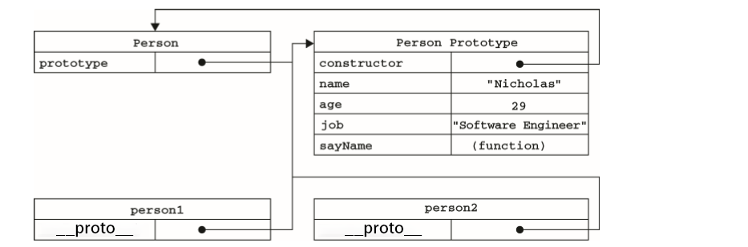

# 面向对象(Object-Oriented，OO）

- OO语言的标志，那就是它们都有类的概念
- ECMAScript中没有类的概念
- Escript把对象定义为：“无序属性的集合，其属性可以包含基本值、对象或者函数。”

## 理解对象

```js
// 早期通过new Object()的方式创建一个对象
var person = new Object(); 
person.name = "Nicholas"; 
person.age = 29;  
person.job = "Software Engineer"; 
person.sayName = function(){     
    alert(this.name); 
}; 
 //sayName()方法用于显示 this.name（将被解析为 person.name）的值
/*---------------------------------------------------------*/
// 后来通过字面量{}的方式创建
var person = {     
    name: "Nicholas",      
    age: 29,     
    job: "Software Engineer", 
    sayName: function(){   
        alert(this.name);  
    } 
}; 
```

## 属性类型

ECMAScript中有两种属性：数据属性和访问器属性

- `数据属性 `

    - [[Configurable]]：表示能否通过 delete 删除属性从而重新定义属性，能否修改属性的特 性，或者能否把属性修改为访问器属性。这个特性默认值为 true
    -  [[Enumerable]]：表示能否通过 for-in 循环返回属性,特性默认值为 true.
    -  [[Writable]]：表示能否修改属性的值,这个特性默认值为 true.
    - [[Value]]：包含这个属性的数据值。读取属性值的时候，从这个位置读；写入属性值的时候， 把新值保存在这个位置。这个特性的默认值为 undefined。 
    - 对于上面的那个例子，创建了一个name属性，为它指定的值是"Nicholas，[[Value]]特性将 被设置为"Nicholas"，而对这个值的任何修改都将反映在这个位置。
    - 要修改属性默认的特性，使`Object.defineProperty()`方法,接受三个参数属性所在的对象、属性的名字和一个描述符对象
    - `Object.defineProperty(person,"name",{ writable: false,value: "change" })`

 - `访问器属性`

    -  [[Configurable]]：和上面的一样

    -  [[Enumerable]]：和上面的一样

    -  [[Get]]：在读取属性时调用的函数。默认值为 undefined

    -  [[Set]]：在写入属性时调用的函数。默认值为 undefined

    - ```js
      var book= {
          _year:2004,
          edition:1
      }
      Object.defineProperty(book, "year", {     get: function(){         
          return this._year;     
      	},     
        set: function(newValue){ 
           if (newValue > 2004) {             		this._year = newValue;             	     this.edition += newValue - 2004;         }     
        }); 
       //以上代码创建了一个 book 对象，并给它定义两个默认的属性：_year 和 edition。_year 前面 的下划线是一种常用的记号，用于表示只能通过对象方法访问的属性。而访问器属性 year 则包含一个 getter函数和一个 setter函数。getter函数返回_year 的值，setter函数通过计算来确定正确的版本。因此， 把 year 属性修改为 2005会导致_year 变成 2005，而 edition 变为 2。这是使用访问器属性的常见方 式，即设置一个属性的值会导致其他属性发生变化
      ```

## 创建对象

### 1、通过 new Object()

### 2、通过 字面量 {}

### 3、通过工厂模式

```js
function createPerson(name, age, job){   
    var o = new Object();    
        o.name = name;    
        o.age = age;    
        o.job = job;     
        o.sayName = function(){     
            alert(this.name);   
        };        
        return o; 
} 
 
var person1 = createPerson("Nicholas", 29, "Software Engineer"); 
var person2 = createPerson("Greg", 27, "Doctor");
//工厂模式虽然解决了创建 多个相似对象的问题，但却没有解决对象识别的问题
```

### 4、构造函数模式

```js
function Person(name, age, job){    
    this.name = name;    
    this.age = age;   
    this.job = job;    
    this.sayName = function(){   
        alert(this.name); 
    };  
} 
 
var person1 = new Person("Nicholas", 29, "Software Engineer"); 
var person2 = new Person("Greg", 27, "Doctor"); 
```

- 构造函数与工厂模式的去区别

  - 没有显式地创建对象； (即没有 new Object())
  - 直接将属性和方法赋给了 this 对象； 
  - 没有 return 语句
  - 函数名首字母大写

- 要创建 Person 的新实例，需要使用new操作符，会经历4个 步骤`var person1 = new Person("Nicholas", 29, "Software Engineer"); `

  - 创建一个新对象
  - 将构造函数的作用域赋给新对象（因此 this 就指向了这个新对象）； 
  -  执行构造函数中的代码（为这个新对象添加属性）； 
  - 返回新对象.

- **实例对象(person1)都 有一个 constructor（构造函数）属性(person2.constructor),该属性指向Person**

  - ```js
    function Person(name, age, job) { 
        this.name = name; 
        this.age = age; 
        this.job = job; 
        this.sayName = function () { 
            alert(this.name); 
        }; 
    }
    var person2 = new Person("Greg", 27, "Doctor");
    console.log(person2.constructor)
    /*
    ƒ Function() { [native code] }
    */
    console.log(person2.constructor)
    //下面是打印的内容
    /* ƒ Person(name, age, job) { 
        this.name = name; 
        this.age = age; 
        this.job = job; 
        this.sayName = function () { 
            alert(this.name); 
        }; 
    }
    */
    //constructor始终指向创建当前对象的构造函数
    ```

- 检测对象类型使用`instanceof`操作符

- `alert(person1 instanceof Object); `

- **构造函数的优势**：可以将它的实例标识为一种特定的类型

- **将构造函数当作函数**

  - 构造函数与其他函数的唯一区别，就在于调用它们的方式不同。不过，构造函数毕竟也是函数，不 存在定义构造函数的特殊语法。任何函数，只要通过 new 操作符来调用，那它就可以作为构造函数；而 任何函数，如果不通过 new 操作符来调用，那它跟普通函数也不会有什么两样。例如，前面例子中定义 的 Person()函数可以通过下列任何一种方式来调用。

  - ```js
    //当作构造函数使用
    var person = new Person("Nicholas", 29, "Software Engineer");
    person.sayName(); //"Nicholas" 
    
    // 作为普通函数调用
    Person("Greg", 27, "Doctor"); // 添加到 window
    window.sayName(); //"Greg" 
    
    // 在另一个对象的作用域中调用
    var o = new Object();
    Person.call(o, "Kristen", 25, "Nurse");
    o.sayName(); //"Kristen" 
    ```

  - 这个例子中的前两行代码展示了构造函数的典型用法，即使用 new 操作符来创建一个新对象。

  - 接下 来的两行代码展示了不使用new操作符调用Person()会出现什么结果：属性和方法都会被添加给Global对象(在浏览器中就是window对象)，当在全局作用域中调用一个函数时，this 对象总是指向 Global 对象(**this既不指向函数自身也不指向函数的词法作用域，this实际上是在函数被调用是发生的绑定，它指向什么完全取决于函数在哪里调用！**)

- **构造函数问题 **

  - 每个方法都要在每个 实例上重新创建一遍(ECMAScript中的函数是对象，因此每定义一个 函数，也就是实例化了一个对象)

  - ```js
    function Person(name, age, job){     			this.name = name;     
        this.age = age;     
        this.job = job;    
        this.sayName = new Function("alert(this.name)"); // 与声明函数在逻辑上是等价的 } 
     //alert(person1.sayName == person2.sayName);  //false 
    ```

  - ```js
    //好的解决方法，将函数移到构造函数外部
    function Person(name, age, job){     			this.name = name;  
    	this.age = age;     
    	this.job = job;     
     	this.sayName = sayName;
    } 
     
    function sayName(){     
        alert(this.name);
    } 
     
    var person1 = new Person("Nicholas", 29, "Software Engineer"); 
    var person2 = new Person("Greg", 27, "Doctor"); 
    //在全局作用域中定义的函数实际上只 能被某个对象调用，这让全局作用域有点名不副实。而更让人无法接受的是：如果对象需要定义很多方 法，那么就要定义很多个全局函数，于是我们这个自定义的引用类型就丝毫没有封装性可言了
    ```

### 5、原型模式

- 创建的构造函数都有一个 **prototype（原型）**属性

  - 这个属性是一个指针，指向一个对象，`而这个对象的用途是包含可以由特定类型的所有实例共享的属性和方法`

  - ```js
    function Person(){ } 
     
    Person.prototype.name = "Nicholas"; Person.prototype.age = 29; Person.prototype.job = "Software Engineer"; Person.prototype.sayName = function(){     alert(this.name); }; 
     
    var person1 = new Person(); person1.sayName();   //"Nicholas" 
     
    var person2 = new Person(); 
    person2.sayName();   //"Nicholas" 
     
    alert(person1.sayName == person2.sayName);  //true 
    ```
  
- 要理解原型模式的工作原理， 必须先理解 ECMAScript中原型对象的性质

  1. **理解原型对象**
     
     1. 无论什么时候，只要创建了一个新的构造函数，就会根据一组特定的规则为该构造函数创建一个prototype属性，这个属性指向构造函数的**原型对象**
     
     2. ```js
        
        function Person(name, age, job) { 
            this.name = name; 
            this.age = age; 
            this.job = job; 
            this.sayName = function () { 
                alert(this.name); 
            }; 
        }
        var person2 = new Person("Greg", 27, "Doctor"); 
        console.log(Person.prototype)
        /*
        {
        constructor: ƒ Person(name, age, job)
        __proto__: Object
        }
        */
        ```
     
     3. 原型对象会自动获取一个constructor属性:这个属性包含一个指向 prototype 属性所在函数的指针
     
     4. ```js
        console.log(Person.prototype.constructor)
        /*
        ƒ Person(name, age, job) { 
            this.name = name; 
            this.age = age; 
            this.job = job; 
            this.sayName = function () { 
                alert(this.name); 
            }; 
        }
        */
        ```
     
     5. 创建了自定义的构造函数之后,，其原型对象默认只会取得 constructor属性;至于其他方法，则 都是从 Object 继承而来的.
     
     6. 调用构造函数创建一个新实例,实例的内部将包含一个指针(__proto__),指向构造函数的原型对象(本例为:Person.prototype)
     
     7. 
     
     8. 构造函数`Person`的属性prototype指向构造函数的原型对象`Person.prototype的输出是一个{constructor:ƒ Person(name, age, job),...}`,这个是构造函数的原型对象，`原型对象`的属性`constructor`又指回了`Person`,原型对象上也可以添加其他属性，(继承就出自这里)。Person构造函数的实例`person1 & person2`的__proto__属性指向构造函数的原型对象(`{constructor:ƒ Person(name, age, job),...}`)!!!!!!!!!!!
     
     9. ES5中新增加了方法， Object.getPrototypeOf()，这个方法返回__proto__的值
     
     10. ```js
         console.log(Object.getPrototypeOf(person2))
         /*
         {
         constructor: ƒ Person(name, age, job)
         __proto__: Object
         }
         */
         ```
     
     11. 更简单的原型语法
     
         1. ```js
            function Person(){ } 
             
            Person.prototype = {    
                name : "Nicholas",   
                age : 29,  
                job: "Software Engineer",   
                sayName : function () {         				alert(this.name);    
                }
            };
            ```

### 6、组合使用构造函数模式和原型模式

构造函数模式用于定义实 例属性，而原型模式用于定义方法和共享的属性

```js
function Person(name, age, job){    
    this.name = name;    
    this.age = age;     
    this.job = job;    
    this.friends = ["Shelby", "Court"]; 
} 
 
Person.prototype = {    
    constructor : Person,   
    sayName : function(){     
        alert(this.name);   
    } 
} 
 
var person1 = new Person("Nicholas", 29, "Software Engineer");
var person2 = new Person("Greg", 27, "Doctor"); 
 
person1.friends.push("Van"); alert(person1.friends);    //"Shelby,Count,Van" alert(person2.friends);    //"Shelby,Count" alert(person1.friends === person2.friends);    
//false alert(person1.sayName === person2.sayName);    //true 
```

### 7、动态原型模式

动态原 型模式正是致力于解决：独立的构造函数和原型时，它把所有信息都封装到了构造函数中

```js
function Person(name,age,job){
    this.name = name
    this.age = age
    this.job
    if(typeof this.sayName!="function"){
         Person.prototype.sayName = function(){             				alert(this.name);        
         }; 
    }
}
var friend = new Person("Nicholas", 29, "Software Engineer"); 
friend.sayName(); 

```

## 继承：是面向对象语言中最为津津乐道的概念。

### 1、原型链

- ES中描述了**原型链**的概念，并将原型链作为实现继承的主要方法。其基本思想是利用原型让一个引用类型继承另一个引用类型的属性和方法